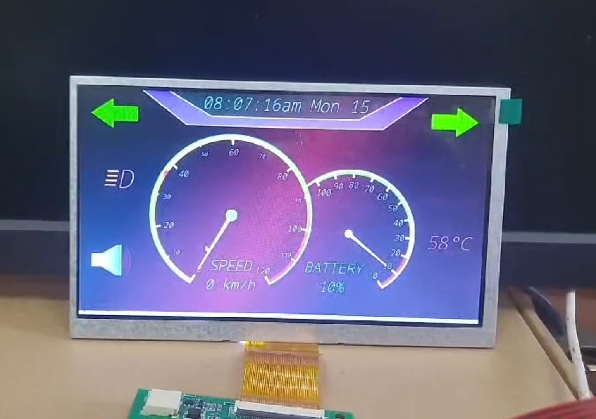
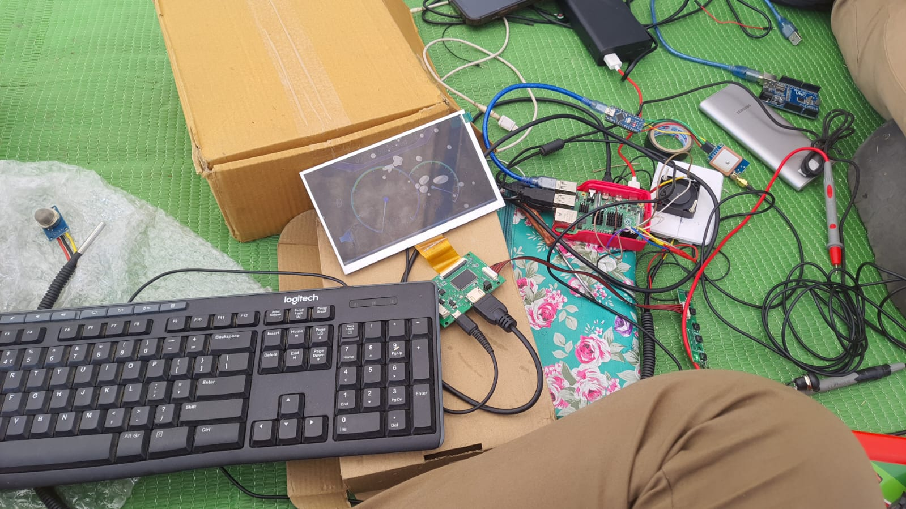
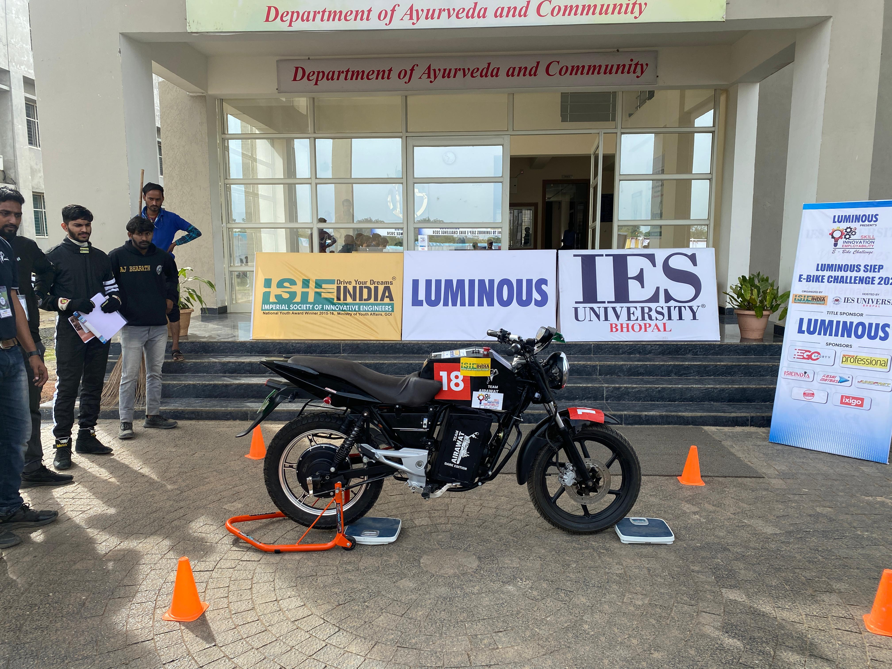

# Bike Dashboard

A Python-based digital dashboard for bikes, built using PyQt5. This application provides real-time speed, temperature, and other vital information in a visually appealing interface.

## Features
 - Real-Time Data Display: Shows real-time speed,battery, charging, temperature, smoke and other essential metrics.
 - Customizable Interface: Modify colors, fonts, and display settings to match your preferences.
 - Smooth Animations: Implemented with high-quality rendering for a smooth user experience.
 - Cross-Platform: Runs on any platform that supports Python and PyQt5.


    
## Screenshots
#### Dashboard

#### Hardware

#### The Bike

#### Preview


## Getting Started
## Prerequisites
Before you begin, ensure you have the following installed:

 - Python 3.x
 - PyQt5


## Installation
####  1. Clone the repository:

```bash
git clone https://github.com/shubhamprasad07/Bike-Dashboard.git
cd Bike-Dashboard

```
or

Download zip file from code.

#### 2. Install the required packages:
```bash
pip install -r requirements.txt
```

#### 3. Run the application:
```bash 
python main.py
```
or
```bash 
python3 main.py
```

### Usage
 - Launch the application and select your desired settings.
 - Connect your bike's sensors to receive real-time data (additional setup may be required for hardware integration).
 - Customize the dashboard interface to match your bike's aesthetics.
### Contributing
Contributions are welcome! Feel free to fork this repository, make your changes, and submit a pull request.

### License
This project is licensed under the MIT License - see the LICENSE file for details.

### Contact
For any inquiries, please contact me at shubhamprasad07@gmail.com.


## Acknowledgements
Used the base code of CodeRunner:-
 - [Youtube](https://www.youtube.com/watch?v=j6BS3f9LM9I)
 - [Github](https://github.com/matiassingers/awesome-readmehttps://github.com/prasanna892/Electric_vehicle_DashBoard)
